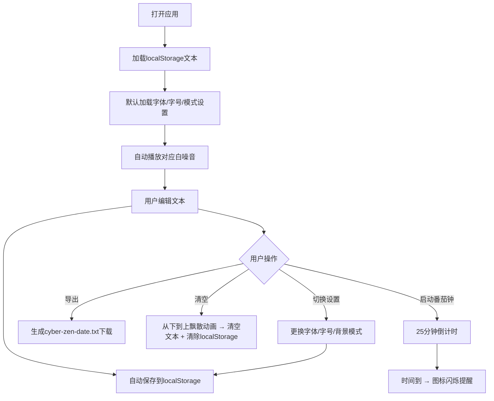

# 赛博禅意 (Cyber Zen)

## 1.1 项目概述
一个极简主义风格的纯前端专注应用，结合文本记录、自然白噪音和番茄钟工作法，帮助用户在沉浸式环境中写作、冥想或学习。

## 1.2 核心问题
- **目标用户**：追求极简美学，需要安静专注环境的创作者、学生、都市职场人士
- **用户场景**：需要专注写作、深度工作或冥想放松时打开，享受雨滴/雪花动态背景配合白噪音，同时记录想法
- **核心痛点**：现有应用功能繁杂干扰专注，缺少结合文本记录+环境白噪音+番茄钟的一体化极简工具

## 1.5 需求范围
**In-Scope**: 
- 可编辑纯文本记录区域，自动本地存储
- 5种字体选择（含手写体）+ 大中小三档字号调节
- 雨天/雪天两种模式切换，对应动态效果+白噪音，支持音量调节
- 导出文本为TXT文件，内容清空飘散动画
- 固定25分钟番茄钟，结束后图标闪烁提醒
- 自适应不同屏幕尺寸
- 刷新页面数据不丢失（localStorage）

**Out-of-Scope**: 
- 登录注册、云同步、用户账号系统
- 富文本格式编辑
- 番茄钟自定义时长、暂停/重置功能
- 番茄钟提示音
- 文本历史版本管理
- 内容分享功能

## 2.1 核心业务流程

## 3.1 边缘情况处理
- localStorage存储文本，容量限制内正常使用，超出不处理
- 切换模式时自动切换白噪音，无需用户额外操作
- 初始加载默认字体为符合风格的一种，字号默认中号
- 文本为空时显示提示文字，不占位
- 浏览器自动播放策略阻止时，需要用户交互后才能播放
- 动态效果对低性能设备影响不做特殊优化，保证基础可用
- 飘散清空功能：使用独立动画容器实现从下往上逐行飘散动画，防止多次点击冲突，过程中禁止重复点击